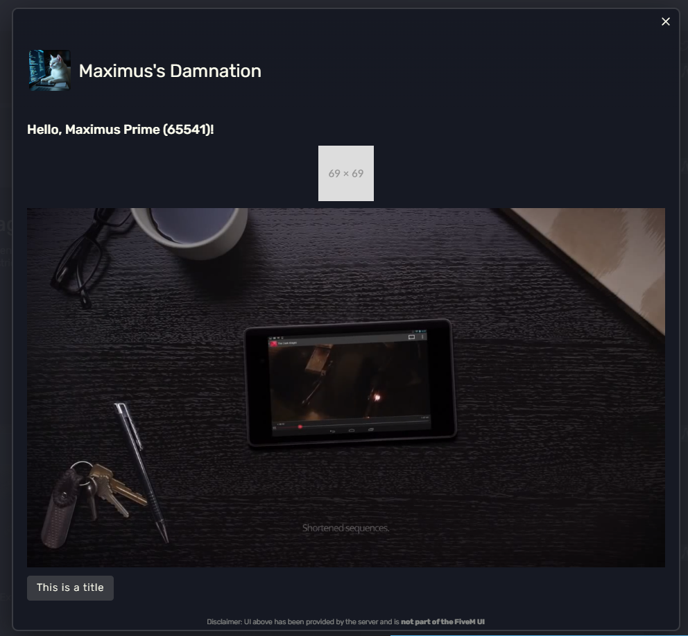

# FiveM Adaptive Cards

A Lua module for FiveM that simplifies the creation and management of **Adaptive Cards**, enabling rich, interactive UIs for players. This resource handles the complexities of the Adaptive Card JSON schema, allowing you to focus on building your user interface.



-----

## 🚀 Features

  * **Object-Oriented**: Create cards, containers, and elements using a clean, class-based syntax.
  * **Built-in Elements**: Easily create common Adaptive Card elements like `TextBlock`, `Image`, and `Media`.
  * **Type Safety**: Utilizes LuaDoc for full auto-completion and type-checking in compatible editors (like Visual Studio Code with the Sumneko Lua extension).
  * **FiveM Integration**: Designed to work seamlessly with the `deferrals.presentCard()` function.

-----

## 📦 How to Use

1.  **Add the Files**: Place `card.lua`, `cardContainer.lua`, and `cardElement.lua` into your FiveM resource's `server` folder.

2.  **Require the Modules**: In your server-side script, import the modules.

    ```lua
    local Card = require 'server.classes.card'
    local CardElement = require 'server.classes.cardElement'
    local CardContainer = require 'server.classes.cardContainer'
    ```

3.  **Create and Present a Card**: Use the provided classes to construct your card and pass the final JSON string to `deferrals.presentCard()`.

-----

## 📝 Example

This is a demo resource, therefor you can simply install it on your server and start messing around with the `server/index.lua` file to discover the system.
If you want to use this within another resource, extract the `lib/` folder and place it into your resource. Please note that this **does require ox_lib** which "fixes" the lua require feature within fxserver, it can be altered to not use it but that is solely on you to do and work it out (because it's not hard, figure it out).
